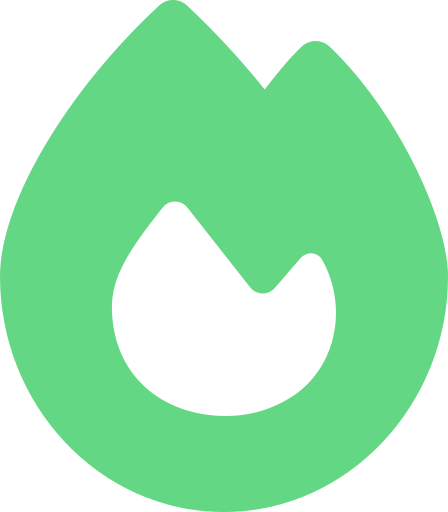
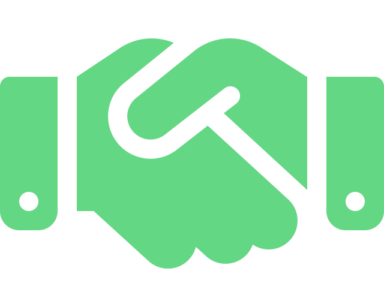
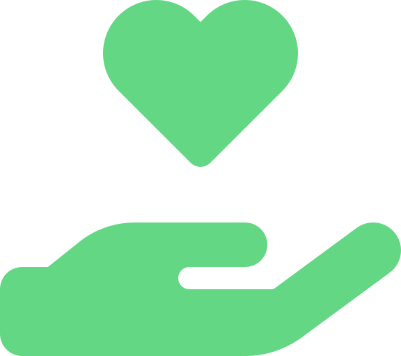

<!-- logo -->

  

<!-- title -->
<h1 align="center" style="display:flex;justify-content:center;align-items:center;width:100%;gap:10px;padding:10px 0;margin-bottom:20px;border-bottom:1px solid #4a4f57">
    Next.js Template Starter
</h1>
<!-- brief description -->

  
  
    
  
  
Next.js Template Starter - pre-configured to Simplify your Workflow

<h2 style="display:flex;align-items:center;gap:10px;padding:10px 0;margin-bottom:20px;border-bottom:1px solid #4a4f57">
  &nbsp;
  Quick overview
</h2>

This repository provides a solid starting point for Next.js projects by offering essential configurations and popular addons commonly used in Next.js development. Developers can quickly set up their projects and leverage the provided features to enhance their productivity and streamline the development process.

  <a href="#">Website</a> •
  <a href="LICENSE">License</a> •
  <a href="CONTRIBUTING.md">Contributing</a>

<h2 style="display:flex;align-items:center;gap:10px;padding:10px 0;margin-bottom:20px;border-bottom:1px solid #4a4f57">
  &nbsp;
  Features
</h2>

Since this is an ongoing project, there are some features that are actively on development. Below are marked the ones that are currently supported. Stay tuned for upcoming ones!

<h3 align="center">✨ ✨ ✨</h3>

 

| Feature              | Description                                                      | Status          |
|:---------------------|:---------------------------------------------------------------- |:--------------: |
| CONFIGURATION                                                                                             |
| Prettier             | Code formatter for consistent styling                             | ✅ DONE        |
| Eslint               | JavaScript/TypeScript linter                                      | ✅ DONE        |
| Husky                | Git hooks for enforcing pre-commit tasks                          | ✅ DONE        |
| Commitlint           | Lint commit messages against a pattern                            | ✅ DONE        |
| Lint staged          | Run linters against staged git files                              | ✅ DONE        |
| Standard Version     | Automate versioning based on Git history                          | ✅ DONE        |
| Semantic Release     | Automated releases based on commit history                        | ✅ DONE        |
| Github Actions       | Continuous integration and workflows                              | ✅ DONE        |
| Codecov              | Code coverage reporting tool                                      | ✅ DONE        |
| TESTING & VALIDATION                                                                                      |
| Storybook            | UI component development environment                              | 🚧 In progress |
| Zod                  | TypeScript-first schema declaration and validation library        | ❌ In progress |
| Jest                 | JavaScript testing framework                                      | ❌ Not started |
| React Testing Library| Testing utilities for React components                            | ❌ Not started |
| Cypress              | End-to-end testing framework                                      | ❌ Not started |
| ADDONS                                                                                                    |
| Zustand              | Global state management                                           | ✅ DONE        |
| React Hook Forms     | Performant forms with easy-to-use validation                      | ❌ In progress |
| NextAuth.js          | Authentication for Next.js                                        | ❌ Not started |
| Next-Themes          | An abstraction for themes in your Next.js app.                    | ❌ Not started |
| Stripe               | An abstraction for themes in your Next.js app.                    | ❌ Not started |
| Cloudinary           | The Most Powerful Image and Video API                             | ❌ Not started |

 

<h2 style="display:flex;align-items:center;gap:10px;padding:10px 0;margin-bottom:20px;border-bottom:1px solid #4a4f57">
  &nbsp;
  Author
</h2>

**Alain Iglesias**

- Website: https://aiherrera.com
- Blog: https://blog.aiherrera.com
- Twitter: [@\_aiherrera](https://twitter.com/_aiherrera)
- Github: [@aiherrera](https://github.com/aiherrera)
- LinkedIn: [@-aiherrera](https://linkedin.com/in/-aiherrera)

<h2 style="display:flex;align-items:center;gap:10px;padding:10px 0;margin-bottom:20px;border-bottom:1px solid #4a4f57">
  &nbsp;
  Contribute
</h2>

Contributions, issues and feature requests are welcome! Feel free to check [issues page](https://github.com/aiherrera/next-template-starter/issues). You can also take a look at the [contributing guide](https://github.com/aiherrera/next-template-starter/blob/master/CONTRIBUTING.md)

<h2 style="display:flex;align-items:center;gap:10px;padding:10px 0;margin-bottom:20px;border-bottom:1px solid #4a4f57">
  &nbsp;
  Support the project
</h2>

If you consider this project worthy give it a ⭐️ and, why not, invite me a coffee 👇🤘🫶

  

<h2 style="display:flex;justify-content:center;align-items:center;gap:10px;padding:10px 0;margin-bottom:20px;border-bottom:1px solid #4a4f57"></h2>

Copyright © 2023 Alain Iglesias

